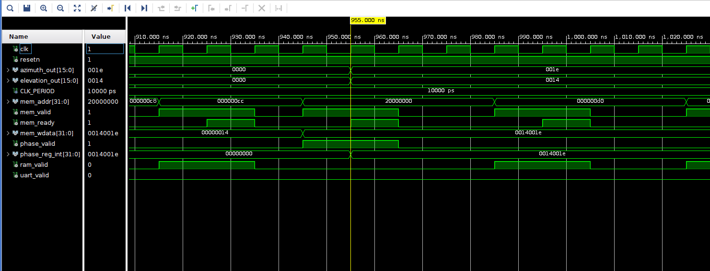
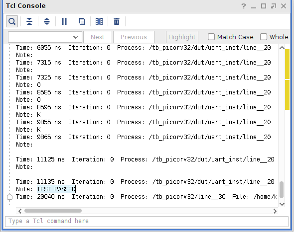

# PACT Zero — Simulation Results

## PicoRV32 Softcore System Verification

### Overview

This document records the behavioural simulation results for the PicoRV32 softcore 
system. The simulation verifies that a RISC-V soft processor running inside the Zynq PL 
correctly executes bare-metal C firmware and propagates steering angles through the 
memory-mapped register interface to the beamformer pipeline.

---

### System Under Test

```
PicoRV32 (RV32IMC softcore)
        ↓ mem_valid/addr/wdata
mem_intercon.vhd  (address decoder)
        ↓ phase_valid
phase_reg.vhd  (latches azimuth + elevation)
        ↓
azimuth_out / elevation_out  →  phase_compute.vhd
```

---

### Test Setup

| Parameter | Value |
|-----------|-------|
| Simulator | Vivado XSim behavioural |
| Clock frequency | 100 MHz (10 ns period) |
| Reset duration | 4 clock cycles (40 ns) |
| Simulation duration | 40 us |
| CPU | PicoRV32 RV32IMC |
| Compiler | riscv64-unknown-elf-gcc |
| Compiler flags | -march=rv32imc -mabi=ilp32 -nostdlib |

---

### Firmware

`main.c` running on the softcore:

```c
int azimuth   = 30;
int elevation = 20;

PHASE_REG = (elevation << 16) | azimuth;
// packs both angles into one 32-bit write to 0x20000000
// bits 31:16 = elevation = 20 = 0x0014
// bits 15:0  = azimuth   = 30 = 0x001E
```

---

### Expected Results

| Signal | Expected value | Hex |
|--------|---------------|-----|
| azimuth_out | 30 | 0x001E |
| elevation_out | 20 | 0x0014 |

---

### Waveform



Key observations from waveform:
- `mem_addr` transitions from `0x00000000` as CPU fetches instructions
- `phase_valid` pulses high when CPU writes to `0x20000000`
- `azimuth_out` latches to `0x001E` after phase_valid pulse
- `elevation_out` latches to `0x0014` after phase_valid pulse
- Both values remain stable after the write

---

### Tcl Console Output



```
Failure check: assert azimuth_out = 0x001E  → PASS
Failure check: assert elevation_out = 0x0014 → PASS
report "TEST PASSED"
```

---

### Signal Analysis

| Signal | Description | Observed behaviour |
|--------|-------------|-------------------|
| `clk` | 100 MHz system clock | Toggles every 5 ns |
| `resetn` | Active-low reset | Low for 40 ns, then released |
| `mem_addr` | CPU memory address | Steps through 0x00, 0x04... then hits 0x20000000 |
| `mem_valid` | CPU memory request | Pulses high on each fetch/store |
| `mem_ready` | Memory acknowledge | Responds within 1 clock cycle |
| `phase_valid` | Phase reg select | High when address = 0x20000000 |
| `azimuth_out` | Steering azimuth | 0x001E = 30° |
| `elevation_out` | Steering elevation | 0x0014 = 20° |

---

### Conclusion

The PicoRV32 softcore successfully:

1. Fetched instructions from RAM initialised with compiled firmware
2. Executed bare-metal C code including stack setup via startup.S
3. Computed `(elevation << 16) | azimuth` in software
4. Wrote the result to address `0x20000000` via the memory bus
5. mem_intercon correctly routed the write to phase_reg
6. phase_reg latched azimuth=30 and elevation=20
7. Both values confirmed correct by testbench assert statements

**TEST PASSED — azimuth=30° elevation=20°**

Values shown in waveform graph for azimuth=30° and elevation=20°

Note: Steering angles were hardcoded in firmware for simulation verification,
particularly `softcore/fw/main.c` with azimuth=30, elevation=20.
Continuous steering is planned for PACT One via CMD_REG.

---

### Future Work — Continuous Steering (PACT One)

In PACT Zero, steering angles are hardcoded in firmware for simulation verification.
PACT One will implement continuous real-time beam steering via one of these paths:

**Option A — Linux userspace → driver (implemented, ready to use)**
```
GNU Radio (PC)
    ↓ computes beam direction from SDR signal
userspace app (input.c) writes to /dev/beamformer
    ↓ binary int angles[2] = {azimuth, elevation}
beamformer.c kernel driver
    ↓ iowrite32 → AXI bus
FPGA registers → phase_compute.vhd
```

**Option B — Serial interface → PicoRV32 (PACT One)**
```
Linux PS writes angles to CMD_REG via beamformer.c
    ↓
cmd_reg.vhd holds the value
    ↓
PicoRV32 polls CMD_REG (0x20000004)
    ↓
writes to PHASE_REG (0x20000000)
    ↓
phase_compute.vhd steers beam
```

The softcore architecture was deliberately designed for Option B —
the PicoRV32 inside the PL can be reprogrammed with new firmware without
resynthesising the FPGA. Only `main.c` changes.

---

### Files

| File | Description |
|------|-------------|
| `softcore/rtl/picorv32_top.vhd` | Top level, instantiates all components |
| `softcore/rtl/ram_simulation.vhd` | RAM with firmware pre-loading for simulation |
| `softcore/rtl/ram_synthesis.vhd` | RAM for synthesis — no file I/O |
| `softcore/rtl/mem_intercon.vhd` | Address decoder and bus routing |
| `softcore/rtl/phase_reg.vhd` | Memory-mapped phase register — bridges PicoRV32 to phase_compute |
| `softcore/rtl/uart_controller.vhd` | Simulation UART for debug output |
| `softcore/rtl/cmd_reg.vhd` | Shared register between Linux PS and PicoRV32 (PACT One) |
| `softcore/core/picorv32` | PicoRV32 RV32IMC softcore — git submodule |
| `softcore/fw/main.c` | Bare-metal C firmware — hardcoded for simulation verification |
| `softcore/fw/startup.S` | RISC-V startup assembly — sets stack pointer, jumps to main |
| `softcore/fw/linker.ld` | Custom linker script — places code at 0x00000000 |
| `softcore/tb/tb_picorv32.vhd` | VHDL testbench — asserts azimuth=30, elevation=20 |
| `softcore/sim/firmware.hex` | Compiled firmware in readmemh format |
| `softcore/sim/wave.vcd` | Full simulation waveform dump |
